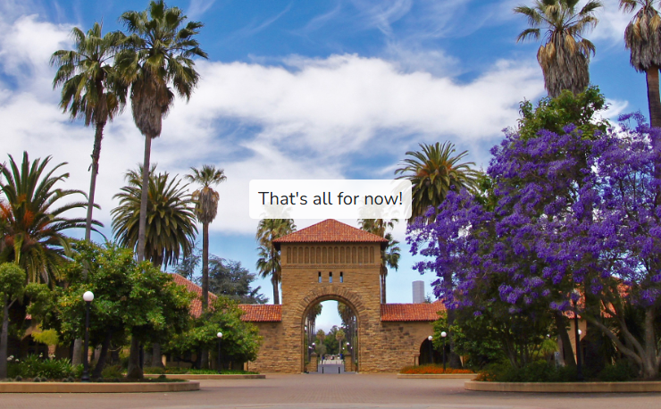

# Code_in_Place-2025_by_Stanford

# 🎓 My Code in Place Journey

Welcome to my repository for the assignments from **Stanford's Code in Place 2025**!  
This course is a wonderful initiative that makes high-quality coding education accessible to thousands of students around the world — completely free of charge.

This repository documents my progress and solutions for the weekly programming challenges.
## 
---

## 📜 Certificate of Completion

I successfully completed the course!  
You can view my certificate here:

👉 [View Certificate](https://codeinplace.stanford.edu/cip5/certificate/5976bs)

---

## 📅 Weekly Assignments

### Week 1
- `2025_Karel.py`
- `Jigsaw_Karel.py`
- `Piles.py`

### Week 2
- `Beeper_Path.py`
- `Fill_Karel.py`
- `Stone_Mason_Karel.py`

### Week 3
- `Dog_Years.py`
- `Hello_Name.py`
- `Multiply_Two_Numbers.py`
- `N_Sided_Dice.py`
- `Sunrise_Fill_in_the_Blanks.py`

### Week 4
- `Double_It.py`
- `Joke_Bot.py`
- `Liftoff.py`
- `Random_Numbers.py`

### Week 5
- `Box_Row.py`
- `Draw_Flag.py`
- `Quilt.py`
- `Scene_with_Functions.py`

### Week 6
- `Compute_Average.py`
- `Quizzlet.py`

---

## 💡 Note

It is **highly recommended** that you first try to solve these problems by yourself.  
The real learning comes from tackling the challenges and debugging your own code.

However, if you find yourself stuck, feel free to learn from this repository — but don’t copy without understanding. 🙂

---
## 🙌 Happy coding!
## 
